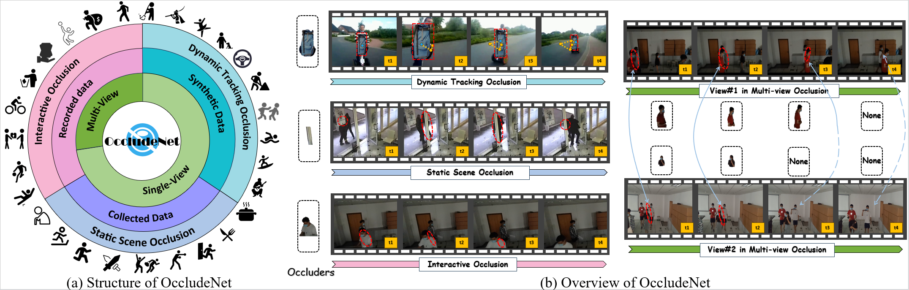
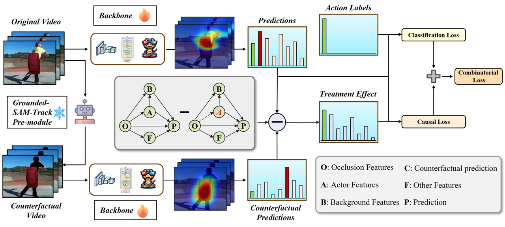

# OccludeNet: A Causal Journey into Mixed-View Actor-Centric Video Action Recognition under Occlusions

Official repository for OccludeNet dataset and Causal Action Recognition.

<div style='display:flex; gap: 0.25rem; '>
<a href='https://arxiv.org/abs/2411.15729'></a>
<a href='LICENCE'></a>
</div>

## 🗓 To-Do List
- [ ] Full Code Release
- [ ] Full Dataset Release
- [x] Preprint version of OccludeNet was released: https://arxiv.org/abs/2411.15729. Welcome to check it out!

## Introduction
The lack of occlusion data in commonly used action recognition video datasets limits model robustness and impedes sustained performance improvements. We construct OccludeNet, a large-scale occluded video dataset that includes both real-world and synthetic occlusion scene videos under various natural environments. OccludeNet features dynamic tracking occlusion, static scene occlusion, and multi-view interactive occlusion, addressing existing gaps in data. Our analysis reveals that occlusion impacts action classes differently, with actions involving low scene relevance and partial body visibility experiencing greater accuracy degradation. To overcome the limitations of current occlusion-focused approaches, we propose a structural causal model for occluded scenes and introduce the Causal Action Recognition (CAR) framework, which employs backdoor adjustment and counterfactual reasoning. This framework enhances key actor information, improving model robustness to occlusion. We anticipate that the challenges posed by OccludeNet will stimulate further exploration of causal relations in occlusion scenarios and encourage a reevaluation of class correlations, ultimately promoting sustainable performance improvements.

## Dataset Structure

### OccludeNet-D
   ```
├── OccludeNet-D

│   ├── train

│   │   ├── 25%

│   │   │   ├──abseiling

│   │   │   │   ├── handbag

│   │   │   │   ├── person

│   │   │   │   ├── ...

│   │   │   ├── air drumming

│   │   │   ├── ...

│   │   ├── 50%

│   │   ├── 75%

│   ├── val

│   ├── test

* There are no more folders under the classification folders such as abseiling, handbag, person, etc. are in the same folder
   ```

<!DOCTYPE html>
<html>
<head>
<style>
/* 样式定义 */
.collapsible {
  background-color: #f9f9f9;
  color: #444;
  cursor: pointer;
  padding: 10px;
  width: 100%;
  border: none;
  text-align: left;
  outline: none;
  font-size: 15px;
}

.active, .collapsible:hover {
  background-color: #ccc;
}

.content {
  padding: 0 18px;
  display: none;
  overflow: hidden;
  background-color: #f1f1f1;
}
</style>
</head>
<body>

<h2>OccludeNet-D</h2>

<button class="collapsible">train</button>
<div class="content">
  <button class="collapsible">25%</button>
  <div class="content">
    <p>abseiling</p>
    <p>handbag</p>
    <p>person</p>
    <p>...</p>
    <p>air drumming</p>
    <p>...</p>
  </div>
  <button class="collapsible">50%</button>
  <div class="content">
    <p>...</p>
  </div>
  <button class="collapsible">75%</button>
  <div class="content">
    <p>...</p>
  </div>
</div>

<button class="collapsible">val</button>
<div class="content">
  <p>...</p>
</div>

<button class="collapsible">test</button>
<div class="content">
  <p>...</p>
</div>

<script>
/* JavaScript代码 */
var coll = document.getElementsByClassName("collapsible");
var i;

for (i = 0; i < coll.length; i++) {
  coll[i].addEventListener("click", function() {
    this.classList.toggle("active");
    var content = this.nextElementSibling;
    if (content.style.display === "block") {
      content.style.display = "none";
    } else {
      content.style.display = "block";
    }
  });
}
</script>

</body>
</html>


### OccludeNet-S

   ```
├── OccludeNet-S

│   ├── train

│   │   ├── abuse

│   │   ├── ...

│   ├── val

│   ├── test
   ```

### OccludeNet-I

   ```
├─train

│  ├─Affix_Poster

│  ├─Armed

│  ├─ ...

│  └─Walk

├─test

│  ├─Affix_Poster

│  ├─Armed

│  ├─ ...

│  └─Walk

└─val

    ├─Affix_Poster
    
    ├─Armed
    
    ├─ ...
    
    └─Walk
   ```

### OccludeNet-M

   ```
├─Armed

│  ├─Armed_view1

│  ├─Armed_view2

│  ├─Armed_view3

│  └─Armed_view_val

├─Basketball_Dribble

│  ├─Basketball_Dribble_view1

│  ├─Basketball_Dribble_view2

│  ├─Basketball_Dribble_view3

│  └─Basketball_Dribble_view_val

├─ ...

└─Wander

    ├─Wander_view1
    
    ├─Wander_view2
    
    ├─Wander_view3
    
    └─Wander_view_val
   ```

## Causal Action Recognition



### Requirements and Dependencies

We assume the environment and the training phase for our experiments following the [UniFormerV2](https://github.com/OpenGVLab/UniFormerV2). You can also follow the method we provide for deployment.

```
git clone https://github.com/OpenGVLab/UniFormerV2.git
cd UniFormerV2
```

- Python >= 3.7
- Numpy
- PyTorch >= 1.9 (Acceleration for 3D depth-wise convolution)
- [fvcore](https://github.com/facebookresearch/fvcore/): `pip install 'git+https://github.com/facebookresearch/fvcore'`
- [torchvision](https://github.com/pytorch/vision/) that matches the PyTorch installation.
  You can install them together at [pytorch.org](https://pytorch.org) to make sure of this.
- simplejson: `pip install simplejson`
- GCC >= 4.9
- PyAV: `conda install av -c conda-forge`
- ffmpeg (4.0 is prefereed, will be installed along with PyAV)
- PyYaml: (will be installed along with fvcore)
- tqdm: (will be installed along with fvcore)
- iopath: `pip install -U iopath` or `conda install -c iopath iopath`
- psutil: `pip install psutil`
- OpenCV: `pip install opencv-python`
- torchvision: `pip install torchvision` or `conda install torchvision -c pytorch`
- tensorboard: `pip install tensorboard`
- moviepy: (optional, for visualizing video on tensorboard) `conda install -c conda-forge moviepy` or `pip install moviepy`
- PyTorchVideo: `pip install pytorchvideo`
- Decord: `pip install decord`

### Causal Action Recognition

Code coming soon.

## Annotations
We provide annotation files for the OccludeNet dataset. The annotation information is saved in a csv file. The content includes the action class, file name, occluder type, occluder file name, occluder pixel ratio, occluder size ratio, occlusion duration, video duration, fps, clip generation time of each video sample. Welcome to check the "Annotations" dir. 

## Citation
Welcome to star our repo and cite our work:
```
@article{zhou2024occludenet,
  title={OccludeNet: A Causal Journey into Mixed-View Actor-Centric Video Action Recognition under Occlusions},
  author={Zhou, Guanyu and Liu, Wenxuan and Huang, Wenxin and Jia, Xuemei and Zhong, Xian and Lin, Chia-Wen},
  journal={arXiv preprint arXiv:2411.15729},
  year={2024}
}
```

## Acknowledgemnet
[UniFormerV2](https://github.com/OpenGVLab/UniFormerV2): Spatiotemporal Learning by Arming Image ViTs with Video UniFormer

[Grounded-SAM](https://github.com/IDEA-Research/Grounded-Segment-Anything): Assembling Open-World Models for Diverse Visual Tasks

[Grounded-SAM-2](https://github.com/IDEA-Research/Grounded-SAM-2): Ground and Track Anything in Videos

[segment-and-track-anything](https://github.com/z-x-yang/segment-and-track-anything): Segment and Track Anything

[EfficientVit](https://github.com/mit-han-lab/efficientvit): Multi-Scale Linear Attention for High-Resolution Dense Prediction

[VideoMamba](https://github.com/OpenGVLab/VideoMamba): State Space Model for Efficient Video Understanding

[PytorchVideo](https://github.com/facebookresearch/pytorchvideo): A deep learning library for video understanding research

[InternVideo2](https://github.com/OpenGVLab/InternVideo): Video Foundation Models for Multimodal Understanding


